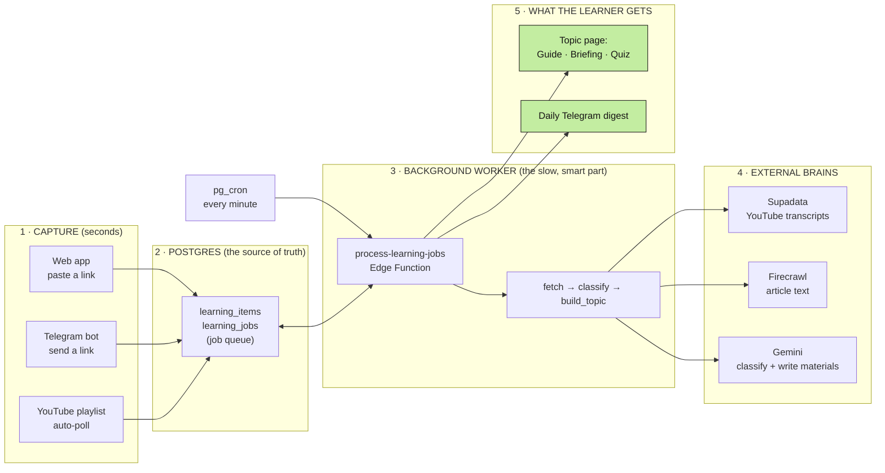

# LearnIT — Solution Architecture

**A plain-language guide for judges.** Read the box, then the picture, then the details. Nothing below assumes you've seen the code.

---

## The one-sentence version

> A learner saves a link. LearnIT reads it, sorts it into a **topic**, and writes a **study guide, a briefing, and a quiz** for that topic — all in the background, on cloud infrastructure, with every user's data walled off from every other user's.

Live app: **learnit-mauve.vercel.app** · Telegram bot: **@learnit_teampura_bot**

---

## The whole system in one picture

**How to read it:** capture is instant and cheap (left). The expensive work — reading the source and writing materials — is handed to a queue in the database and done later by a background worker that a clock (`pg_cron`) wakes up every minute. That's why **you can close the browser and it keeps working.**

---

## How one link becomes a lesson (the five stages)

Every source — whether it arrived from the web, Telegram, or a playlist — travels the exact same road. The Library screen shows each item's current stage in real time.

| Stage | What happens | What the user sees |
| --- | --- | --- |
| **New** | The link is saved and queued. Capture is done. | Item appears instantly |
| **Fetched** | Supadata pulls the YouTube transcript, or Firecrawl scrapes the article text. | "Fetched" |
| **Sorting** | Gemini reads the text and files it under a durable **topic**. | "Sorting" |
| **Sorted → Done** | Gemini rebuilds that topic's Study Guide, Briefing, and Quiz from *all* its sources at once. | "Done" — topic ready to study |

If any stage fails, the item is marked **"Needs attention"**, it names the stage that broke, and the user can retry *just that stage* — the rest of their library is untouched.

---

## Three design decisions worth a judge's attention

**1. The topic is the unit of study, not the link.**
Save three videos about networking and you don't get three orphaned summaries — you get *one* Networking topic whose materials are rebuilt to include all three. Old versions are kept. This is the core product idea, enforced in the data model.

**2. The web app holds no keys and runs no long jobs.**
The Next.js app never touches a service-role key. Every read and write goes through Postgres **Row-Level Security** as the signed-in user, so isolation is enforced by the *database*, not by careful UI code. All generation happens in the `process-learning-jobs` Edge Function, driven by the job queue — so capture and generation keep working with the browser closed.

**3. It fails closed, not open.**
The background worker rejects any invocation missing its shared secret (kept in Supabase Vault, never in a file). Defensive limits cap daily captures, worker batch sizes, retries, source counts, transcript length, and AI input size — so a runaway or abusive input can't melt the free tier.

---

## Tech at a glance

| Layer | Choice |
| --- | --- |
| **Frontend** | Next.js 16 (App Router), React 19, Tailwind CSS v4, TypeScript |
| **Hosting** | Vercel |
| **Backend / DB / Auth** | Supabase — Postgres + Auth + Row-Level Security |
| **Background jobs** | Supabase Edge Functions (Deno) + `pg_cron` (worker every minute, maintenance hourly) + `pg_net` |
| **Secrets** | Supabase Vault (`project_url`, `internal_cron_secret`); function secrets server-side only |
| **YouTube transcripts** | Supadata |
| **Article scraping** | Firecrawl |
| **AI generation** | Google Gemini (`gemini-2.5-flash`) — topic classification + validated Study Guide / Briefing / Quiz |
| **Messaging** | Telegram Bot API (capture + daily digest webhook) |
| **Quality gates** | 101 unit tests (Vitest) + 69 database assertions (pgTAP); CI on every push |

---

## Why this architecture is the right call for the problem

Capturing a link must feel instant, but reading a source and writing good study material is slow and uses paid AI credits. Splitting the two — **instant capture in the app, durable slow work in a database-driven queue** — is what lets LearnIT be responsive, resilient to failure (every stage retries), safe on a free tier (hard limits everywhere), and private by construction (isolation lives in the database). No user's laptop and no always-on server babysitting is required; a one-minute clock inside Postgres drives the whole engine.
